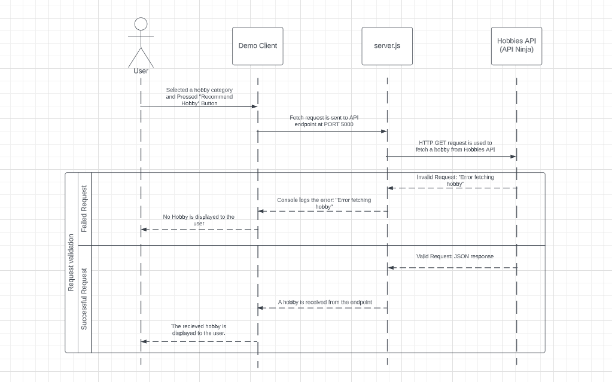

# Hobby Recommendation Microservice README

## How to Programmatically REQUEST Data from the Hobby Recommendation Microservice
The Hobby Recommendation Microservice allows you to request a random hobby based on a specified category. The following instructions will guide you on how to programmatically request data from the Hobby Recommendation Microservice.

### Endpoint
The endpoint for requesting a random hobby is:

GET /api/hobbies

### Request Parameters
The Hobby Recommendation Microservice accepts one optional query parameter:

 - 'category': Specify the category of hobbies you are interested in. The default category is "general." Valid category options are "general," "sports_and_outdoors," "education," "collection," "competition," and "observation."

### Response
The response will be a JSON object containing the recommended hobby based on the specified category.

### Example Response

{
  "hobby": "Gardening"
}

### Example Call
You can use any programming language or library that supports making HTTP GET requests. Below is an example using JavaScript with the fetch API:

// Replace "selectedCategory" with the category you want to retrieve hobbies for.
const selectedCategory = "sports_and_outdoors"; // Replace with the desired category.

function requestRecommendedHobby() {
  // URL of the Hobby Recommendation Microservice
  const url = `http://localhost:5000/api/hobbies?category=${selectedCategory}`;

  // Send a GET request to the microservice
  fetch(url)
    .then((response) => response.json())
    .then((data) => {
      const recommendedHobby = data.hobby;
      console.log(`Recommended Hobby: ${recommendedHobby}`);
    })
    .catch((error) => {
      console.error('Error fetching recommended hobby:', error);
    });
}

requestRecommendedHobby();

Make sure to replace "http://localhost:5000" with the actual URL of your deployed Hobby Recommendation Microservice.

## How to Programmatically RECEIVE Data from the Hobby Recommendation Microservice
The Hobby Recommendation Microservice does not have an endpoint for receiving data. Instead, it provides a response to the GET request containing the recommended hobby, as described in the previous section.

Please follow the instructions in the "How to Programmatically REQUEST Data from the Hobby Recommendation Microservice" section to retrieve the recommended hobby.

Note: Before making any requests, ensure that the Hobby Recommendation Microservice is running and accessible through the appropriate URL.

For any questions or issues related to the Hobby Recommendation Microservice, please refer to the documentation or contact the system administrator.

## UML Sequence Diagram for Hobby Recommendation Service:

